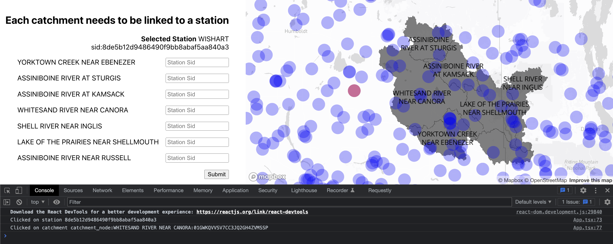

# Introduction
This small demo project is meant to provide an example of the kinds of data we work with at YellowSub, frontend technology we use and an example of a feature that you might be implementing.
# Setup
`npm install`

`npm start`

# Dataset
This project includes some data straight from our datawarehouse and model outputs in the form of geojson & json files, located in [/public/data](./public/data).

## All_Catchment_Boundaries.geojson

This file contains 7 catchments with their respective:
- Polygon representing the boundary (also drawn on the map when running the project)
- `properties.name`: name for the catchment
- `properties.uuid`: identifier used by the backend code to refer to the catchment
- ... (statistics about the catchment and flags on how it can be used, feel free to ignore these)

These boundaries are created by a python script that starts from a list of points on a river network and calculates the bounderies based on topology.

## climate_stations.geojson

This file contains stations for the region around the catchments. The `properties.station_sid` key will contain the identifier we'll be using to refer to individual stations.

## climate_stations_availability.json
The availability of data for stations.

# Frontend
When running the UI in this repo you should see the image below:

(The chrome dev console is opened in the screenshot)

A crucial step in the modelling process is to assign to each catchment a station which will be used to train a model to predict river flows and validate the performance of the model.

We do this by providing a `station_sid`, `date range for training` and a `date range for validation` for each catchment. These choice of which station to use for a catchment is based on data availability (but in periscope we also display graphs showing more details about the data to aid the user in the selection, we didn't include that data here).

The current frontend in this project shows a way to input the `station_sid` for each catchment by selecting it on the map and copy/pasting the sid into the text field. 

# Task
Feel free to either continue on this project, or use the data provided in this project in any other way you see fit using libraries/technologies you're more comfortable with. **Don't let the choices made here limit you.**

Possible improvements to the current UI would be:
- Improve the look and feel of the UI (feel free to use your UI library of choice)
- Implement date range fields for each of catchment-station selection
	
	Dates should be between 1/1/1980 and the current date, and no overlap between training and validation ranges.
- Display the data availability for each station using a popup ([example](https://visgl.github.io/react-map-gl/examples/controls)) (if available in the dataset)
- Visualise the data availability for a station (or lack of) on the map
- Implement a select field that lists the stations (*sorted by [distance](https://turfjs.org/docs/#distance) from the catchment center*) for selection of a station_sid for each catchment (instead of having the user copy/paste the station_sid)
	```ts
	import { distance } from "@turf/turf";
	function calculateDistanceFromCatchment(catchment, station) {
		const from = station.geometry.coordinates;
		const to = [catchment.properties._center_longitude, catchment.properties._center_latitude];
		return distance(from, to, { units: "kilometers" });
	}
	```
- Allow selection of catchment and station from the map without having to use a form
- When hovering over a catchment in the form, highlight the catchment on the map
- Refactor the code by componentizing the form, map and create hooks for data-fetching.

These are mere suggestions and you're very welcome to showcase what you can do any way you like using the data provided.